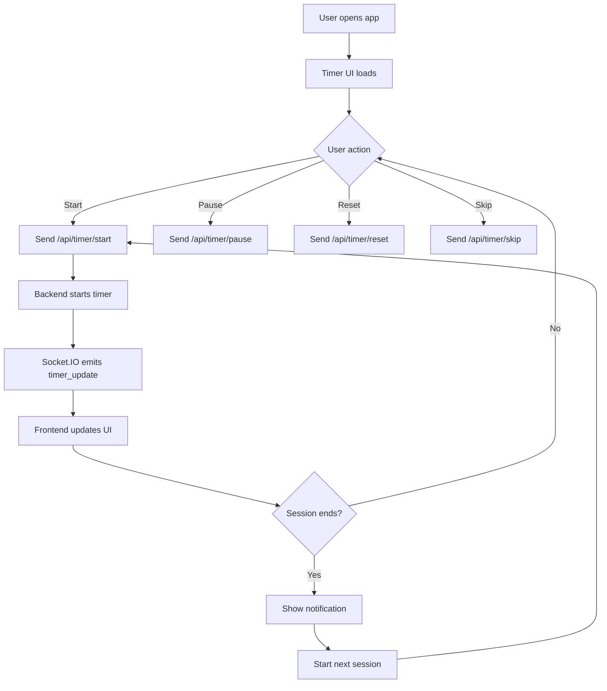
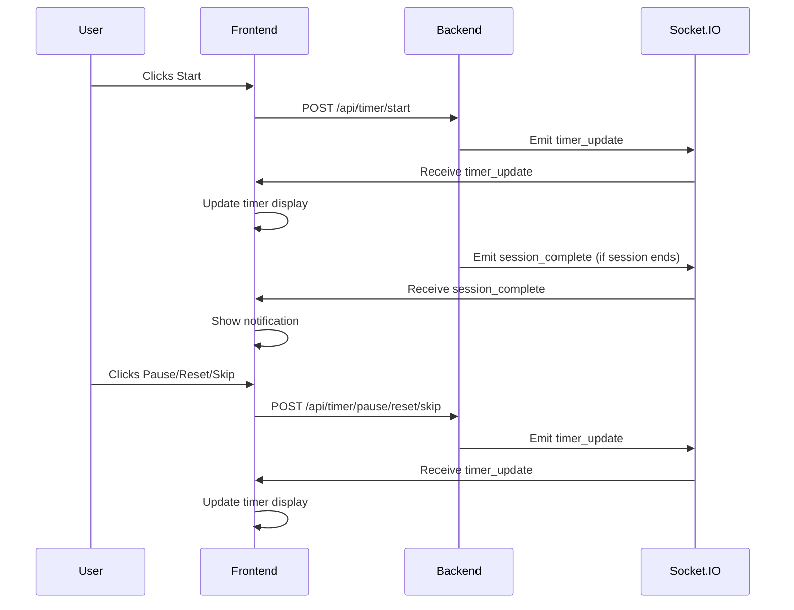

# Pomodoro Timer Web Application Documentation

## Overview
This application is a modern Pomodoro timer built with Flask (Python) for the backend and HTML/CSS/JavaScript for the frontend. It features real-time updates, audio/visual notifications, and a clean, responsive UI. The project is designed for educational purposes and demonstrates best practices in web development and GitHub Copilot usage.

---

## User Flow Chart

---

## Sequence Diagram

---

## How the Application Works

### 1. User Interface
- The user interacts with a timer display, control buttons (start, pause, reset, skip), and session indicators.
- UI updates in real-time as the timer progresses or session changes.

### 2. Backend API
- Flask provides REST endpoints for timer control and configuration.
- Timer logic runs in a background thread, managing session transitions and timing.
- Socket.IO is used for real-time communication, broadcasting timer updates and session completions to all connected clients.

### 3. Frontend Logic
- JavaScript modules handle timer state, UI updates, notifications, and Socket.IO events.
- Audio and browser notifications alert the user when sessions start/end.
- LocalStorage is used for user preferences and session statistics.

### 4. Real-Time Updates
- When the timer starts, the backend emits `timer_update` events via Socket.IO.
- The frontend listens for these events and updates the timer display instantly.
- Session transitions trigger notifications and UI changes.

### 5. Customization & Persistence
- Users can adjust session durations and themes via the settings panel.
- Preferences are saved locally and can be loaded on subsequent visits.

---

## Key Features
 - Enhanced Visual Feedback: The application now provides improved visual cues and effects during timer transitions, session completions, and notifications. This includes dynamic animations, color changes, and more engaging feedback to help users track their progress and stay motivated.
- Modular codebase: `models/`, `routes/`, `services/`, `static/`, `templates/`
- RESTful API and Socket.IO for real-time features
- Unit tests for backend logic and API endpoints
- Easily extensible for new features

---

For more details, see `docs/architecture.md`.
